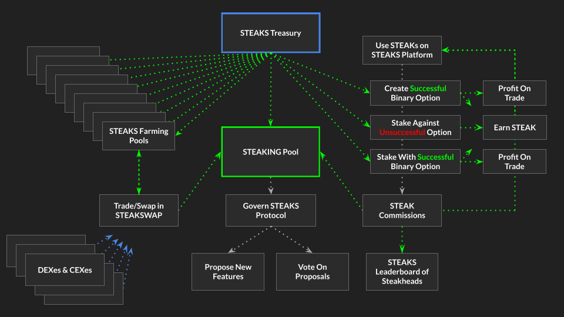

## Steaks.finance  

## Mainnet Contracts

- Steaks Token - https://etherscan.io/address/0xeED9e4F2450035D6426276a8aA2084966EE3b1bb
- SteakBar - https://etherscan.io/address/0x6810536A08D00d51c2C48e0a06537A26828718ba
- MasterChef - https://etherscan.io/address/0xd58211d19f1A91a9a379D7BE4E20B4e4C3d42c17
- SteakMaker - https://etherscan.io/address/0xeaD300c2089809a4EdA0b7728B728829867dF960
- Migrator - https://etherscan.io/address/0x2E6B93f113df8e46547939e0C62677DDfeeb35Fe
- Timelock - https://etherscan.io/address/0x8B8cFc71425af029b0C4E00140863105b4f5B136
- Governance - https://etherscan.io/address/0x9A3415Fb9c2Bbf8d0D57dAFf900A22068E75a65D
- SteakswapV2Factory - https://etherscan.io/address/0x2235CFdC3A76f964D6a2292e3b2955373F2aa654
- SteakswapV2Router02 - https://etherscan.io/address/0x4de210C42F7f32033eE6Dd01dB0C5d57fAAfF0d3


### STEAKS Token Flow




## Set up local environment

### Dependencies

Install `ganache` and `truffle` clis:

```
npm install -g ganache-cli truffle truffle-flattener
npm i
```

You need python dev package, the below command works for Ubuntu:

```
sudo apt install libpython3.8-dev
```

Install `pipenv` environment:

```
pipenv sync
```

Install [Metamask](https://metamask.io/download.html).


## Deployment
First we need to import the Deployer account (will be prompted to enter private key):
```
pipenv run brownie accounts new deployer
```

If not already, set `WEB3_INFURA_PROJECT_ID` in `.env`.

### Deploy the STEAK token

```
pipenv run brownie run deploy/0_steak_token.py --network mainnet
```

Set the `STEAK_TOKEN` address  in `config.py`.

### Deploy the DAO

```
pipenv run brownie run deploy/1_governance.py --network mainnet
```

Set the `TIMELOCK`  and `GOVERNOR` addresses  in `config.py`.

### Deploy the SteakSwap exchange

First, get the `V2_PAIR_HASH` from calling Factory.pairCodeHash() in test env.

**Make sure to update the pair hash in `UniswapV2Library.sol:24`.**

```
pipenv run brownie run deploy/2_steakswap.py --network mainnet
```
Set the `V2_FACTORY` and `V2_ROUTER` addresses  in `config.py`.


### Deploy the MasterChef

```
pipenv run brownie run deploy/3_masterchef.py --network mainnet
```

Set the `STEAK_BAR`, `STEAK_MAKER`, `MASTER_CHEF` and `MIGRATOR` addresses  in `config.py`.

## Generate the Etherscan Contract Verification codes

For each deployed contract, a `truffle-flattener` must run, ie:

```
truffle-flattener contracts/SteakToken.sol > etherscan.sol
```
The code of the flattener output needs to be modified to:
 - remove duplicate SPDX-License identifiers

To generate constructor ABI-encoded parameters, get the abi:
```
cat build/contracts/UniswapV2Factory.json | jq .abi
```

Then use this tool to encode it:
https://abi.hashex.org/
